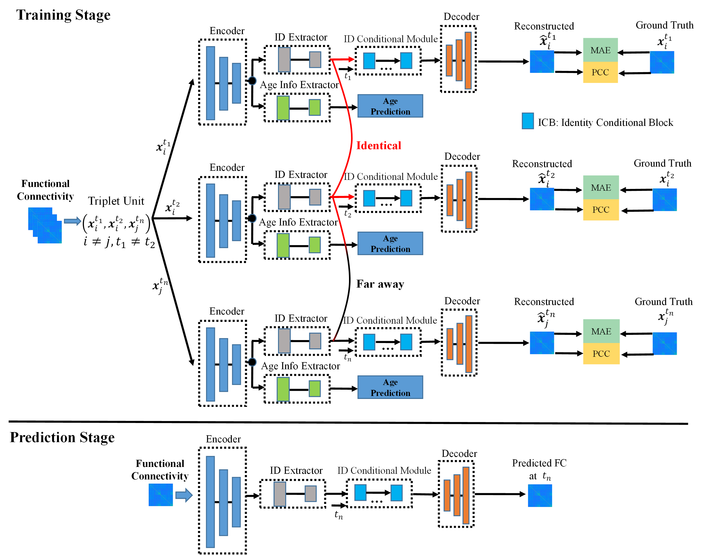

# Longitudinal infant functional connectivity prediction via conditional intensive triplet network

### Framework:

### Papers:
This repository provides a PyTorch implementation of the models adopted in the following papers:

- Hu, D., et al. "Disentangled intensive triplet autoencoder for infant functional connectome fingerprinting." International Conference on Medical Image Computing and Computer-Assisted Intervention. Springer, 2020.
- Yu, X., et al. "Longitudinal infant functional connectivity prediction via conditional intensive triplet network." International Conference on Medical Image Computing and Computer-Assisted Intervention. Springer, 2022.

### Code:
#### main_pcc_mae.py
You need to run this file to start. The hyper-parameters of loss weight can be defined in this file.

Run `python ModelCode\main_pcc_mae.py`. 

#### NNFunctions.py
We created a triple construction method in this file.

Tested with:
- PyTorch 1.9.0
- Python 3.7.0

### Citation:
If you used the code or data of this project,  please cite:

    @inproceedings{hu2020disentangled,
    title={Disentangled intensive triplet autoencoder for infant functional connectome fingerprinting},
    author={Hu, Dan and Wang, Fan and Zhang, Han and Wu, Zhengwang and Wang, Li and Lin, Weili and Li, Gang and Shen, Dinggang and UNC/UMN Baby Connectome Project Consortium},
    booktitle={Medical Image Computing and Computer Assisted Intervention--MICCAI 2020: 23rd International Conference, Lima, Peru, October 4--8, 2020, Proceedings, Part VII 23},
    pages={72--82},
    year={2020},
    organization={Springer}
    }
    
    @inproceedings{yu2022longitudinal,
    title={Longitudinal infant functional connectivity prediction via conditional intensive triplet network},
    author={Yu, Xiaowei and Hu, Dan and Zhang, Lu and Huang, Ying and Wu, Zhengwang and Liu, Tianming and Wang, Li and Lin, Weili and Zhu, Dajiang and Li, Gang},
    booktitle={International Conference on Medical Image Computing and Computer-Assisted Intervention},
    pages={255--264},
    year={2022},
    organization={Springer}
    }

